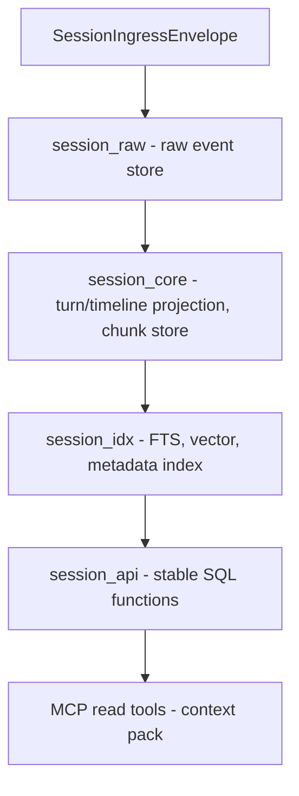

# System Architecture Overview

This document provides a high-level overview of the `cic-mcp-session` component's architecture
and its role within the `cic-mcp-*` family. The goal is for a new developer/agent to understand
the component's fundamental concepts and boundaries within 5-10 minutes.

The full, normative design source lives in the `cic-mcp-factory` repo:
[`.cic-context/factory-docs/architecture.md`](https://github.com/CentralInfraCore/cic-mcp-factory/blob/main/.cic-context/factory-docs/architecture.md#cic-mcp-session) —
this document is the session-specific excerpt of it.

## The "Session layer" concept

In the trust-domain layering of the `cic-mcp-*` family, this component stores and serves
**a single conversation/session scope** over MCP. It is not canonical knowledge and not
cross-session memory — it lives within the boundary of one session.

```text
cic-mcp-knowledge   reviewed/canonical knowledge, versioned
cic-mcp-workdir     current repo/worktree/branch/diff (= role filled by cic-factory)
cic-mcp-session     session-scope event, timeline, chunk, retrieval, provenance   ← THIS REPO
cic-mcp-shared      cross-session memory, weighting, conflict
cic-mcp-gateway     trust-domain aware context compiler
cic-mcp-factory     the family's capability production/maintenance factory
```

## Boundaries

**Yes:**
- `SessionIngressEnvelope` ingest
- raw event store
- turn/timeline projection
- chunk store
- source/provenance refs
- metadata index, full-text search, vector search
- session-scope context pack
- stable SQL/API/MCP read tools

**No:**
- canonical knowledge
- shared memory
- cross-session graph
- final decision mining
- promotion without human review

## Trust model

```yaml
canonical: false
promotion_allowed: false
interpreted: false   # at ingress/raw level
default_scope: session_id
cross_session: false
```

## Data flow (Postgres-first, implemented)



Schema separation: `session_raw` / `session_core` / `session_idx` / `session_jobs` (outbox/retry)
/ `session_api`. The trigger layer must never call an LLM or HTTP — only content-hash checks,
field updates, and outbox enqueueing. The detailed DDL was designed by the
`session-postgres-storage-design-001` capability job (`output/session-postgres-storage-design.md`)
and applied against a real Postgres instance by `session-raw-event-store-001`
(`output/session-postgres-schema.sql`, `output/session-raw-event-store-report.md`).

## Current state

Every step of the data flow above is implemented and proven against a real Postgres instance
(~17 capability jobs, see `output/session-*-report.md` for the evidence behind each claim):

- **A -> B (ingest -> raw event store)**: `session_store/envelope_writer.py:165`
  (`insert_envelope`) writes into `session_raw.envelopes`; the real producer is
  `hooks/log-event.py:303-304` (builds an envelope from a Claude Code hook's stdin JSON and
  calls `insert_envelope()`) — `output/session-raw-event-store-report.md`,
  `output/session-hook-collector-report.md`
- **B -> C (turn/timeline projection, chunk store)**: `session_store/turn_projector.py:300`
  (`run_projection_batch`) projects into `session_core.sessions`/`turns`;
  `session_store/chunk_indexer.py:378` (`run_indexing_batch`) splits turns into
  `session_core.chunks` — `output/session-turn-projector-report.md`,
  `output/session-chunk-indexer-report.md`
- **C -> D (FTS, vector, metadata index)**: the chunk-indexer worker populates
  `session_idx.chunk_fts` and `session_idx.chunk_embeddings`
  (`paraphrase-multilingual-MiniLM-L12-v2`, actual dimension 384, measured not assumed) —
  `output/session-chunk-indexer-report.md`
- **D -> E (session_api stable SQL functions)**: `search_context()` (FTS),
  `search_context_vector()` (cosine/HNSW), `search_context_hybrid()` (RRF fusion),
  `get_timeline()`, `get_context_pack()`, `session_status()`, `get_source_refs()` —
  `output/session-retrieval-quality-report.md`, `output/session-vector-search-api-report.md`,
  `output/session-hybrid-search-api-report.md`, `output/session-source-refs-api-report.md`
- **E -> F (MCP read tools)**: `mcp-server/session_server.py` - 7 tools
  (`search_session_context` plus `search_session_context_fts`/`search_session_context_vector`/
  `get_session_timeline`/`get_session_context_pack`/`get_session_status`/
  `get_session_source_refs`) — `output/session-mcp-tools-report.md`,
  `output/session-mcp-tools-remaining-report.md`
- **scheduled worker loop**: `session_store/worker_loop.py:65`/`:93`
  (`run_one_iteration`/`run_loop`), chains the B->C and C->D steps above —
  `output/session-worker-scheduler-report.md`
- **host-native startup**: `.mcp.json.tpl` uses `{{REPO_ROOT}}/.venv-host/bin/python` —
  `output/session-mcp-venv-fix-report.md`

Documented gap: production reachability of the above components is currently `scaffold`
level — no deployed cron/systemd schedule drives the worker loop in production
(`output/session-worker-scheduler-report.md` "Risks"), and the `cic-session` MCP server is not
wired into any live orchestrator/Claude Code session's `.mcp.json`
(`output/session-mcp-config-wiring-report.md`).
