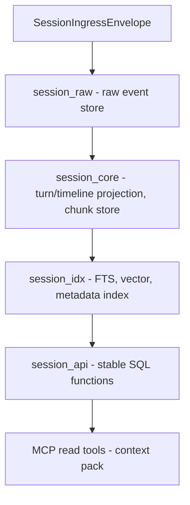

# System Architecture Overview

This document provides a high-level overview of the `cic-mcp-session` component's architecture
and its role within the `cic-mcp-*` family. The goal is for a new developer/agent to understand
the component's fundamental concepts and boundaries within 5-10 minutes.

The full, normative design source lives in the `cic-mcp-factory` repo:
[`.cic-context/factory-docs/architecture.md`](https://github.com/CentralInfraCore/cic-mcp-factory/blob/main/.cic-context/factory-docs/architecture.md#cic-mcp-session) —
this document is the session-specific excerpt of it.

## The "Session layer" concept

In the trust-domain layering of the `cic-mcp-*` family, this component stores and serves
**a single conversation/session scope** over MCP. It is not canonical knowledge and not
cross-session memory — it lives within the boundary of one session.

```text
cic-mcp-knowledge   reviewed/canonical knowledge, versioned
cic-mcp-workdir     current repo/worktree/branch/diff (= role filled by cic-factory)
cic-mcp-session     session-scope event, timeline, chunk, retrieval, provenance   ← THIS REPO
cic-mcp-shared      cross-session memory, weighting, conflict
cic-mcp-gateway     trust-domain aware context compiler
cic-mcp-factory     the family's capability production/maintenance factory
```

## Boundaries

**Yes:**
- `SessionIngressEnvelope` ingest
- raw event store
- turn/timeline projection
- chunk store
- source/provenance refs
- metadata index, full-text search, vector search
- session-scope context pack
- stable SQL/API/MCP read tools

**No:**
- canonical knowledge
- shared memory
- cross-session graph
- final decision mining
- promotion without human review

## Trust model

```yaml
canonical: false
promotion_allowed: false
interpreted: false   # at ingress/raw level
default_scope: session_id
cross_session: false
```

## Planned data flow (Postgres-first, not yet implemented)



Schema separation: `session_raw` / `session_core` / `session_idx` / `session_jobs` (outbox/retry)
/ `session_api`. The trigger layer must never call an LLM or HTTP — only content-hash checks,
field updates, and outbox enqueueing. Detailed DDL design is the responsibility of the
`session-postgres-storage-design-001` capability job.

## Current state

The repo was bootstrapped from the `base-repo` `mcp/main` MCP server scaffold (2026-06-20) —
none of the above data flow is implemented yet, `source/` is empty. The inherited
`make_source.py`/`mcp-server/` infrastructure is generic; session-specific content
(SessionIngressEnvelope schema, Postgres migration) will arrive from the next capability jobs:
`session-ingress-envelope-contract-001`, `session-postgres-storage-design-001`.
