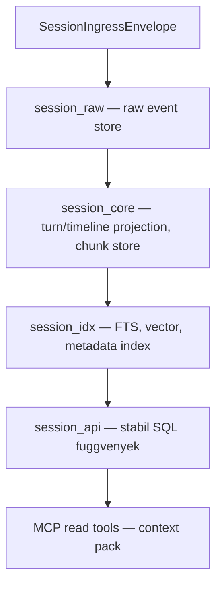

# Rendszer Architektúra Áttekintés

Ez a dokumentum a `cic-mcp-session` komponens magas szintű architektúráját és a `cic-mcp-*`
családban betöltött szerepét mutatja be. A cél, hogy egy új fejlesztő/agent 5-10 perc alatt
megértse a komponens alapvető koncepcióit és határait.

A teljes, normatív tervezési alap a `cic-mcp-factory` repóban él:
[`.cic-context/factory-docs/architecture.md`](https://github.com/CentralInfraCore/cic-mcp-factory/blob/main/.cic-context/factory-docs/architecture.md#cic-mcp-session) —
ez a dokumentum annak a session-specifikus kivonata.

## A "Session réteg" koncepció

A `cic-mcp-*` család trust-domain rétegezésében ez a komponens **egyetlen beszélgetés/session
scope-ját** tárolja és szolgálja ki MCP-n keresztül. Nem canonical tudás, nem cross-session
memória — egy session határain belül él.

```text
cic-mcp-knowledge   reviewed/canonical tudás, verziózott
cic-mcp-workdir     aktuális repo/worktree/branch/diff (= cic-factory szerepe)
cic-mcp-session     session-scope event, timeline, chunk, retrieval, provenance   ← EZ A REPO
cic-mcp-shared      cross-session memória, súlyozás, konfliktus
cic-mcp-gateway     trust-domain aware context compiler
cic-mcp-factory     a család capability gyártó/karbantartó factory-ja
```

## Fő határok

**Igen:**
- `SessionIngressEnvelope` ingest
- raw event store
- turn/timeline projection
- chunk store
- source/provenance refs
- metadata index, full-text search, vector search
- session-scope context pack
- stabil SQL/API/MCP read tools

**Nem:**
- canonical tudás
- shared memory
- cross-session graph
- végleges döntésbányászat
- human review nélküli promotion

## Trust modell

```yaml
canonical: false
promotion_allowed: false
interpreted: false   # ingress/raw szinten
default_scope: session_id
cross_session: false
```

## Tervezett adatfolyam (Postgres-first, még nem implementált)



Schema szeparáció: `session_raw` / `session_core` / `session_idx` / `session_jobs` (outbox/retry)
/ `session_api`. A trigger réteg nem hívhat LLM-et vagy HTTP-t — csak content hash ellenőrzést,
mező-frissítést, outbox enqueue-t végezhet. A részletes DDL-tervezés a
`session-postgres-storage-design-001` capability-job feladata.

## Jelenlegi állapot

A repo a `base-repo` `mcp/main` MCP-szerver scaffold-jából lett bootstrapelve
(2026-06-20) — a fenti adatfolyamból jelenleg semmi nincs implementálva, a `source/` mappa
üres. A `make_source.py`/`mcp-server/` örökölt infrastruktúra generikus, session-specifikus
tartalom (SessionIngressEnvelope schema, Postgres migráció) a következő capability-jobokból
fog megérkezni: `session-ingress-envelope-contract-001`, `session-postgres-storage-design-001`.
