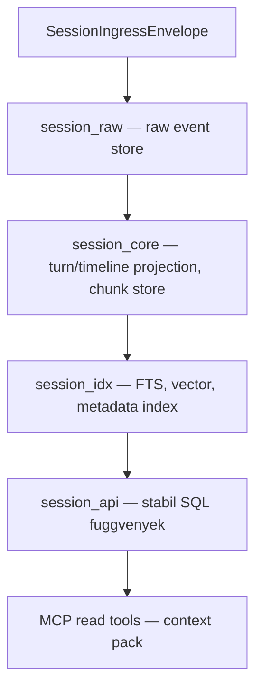

# Rendszer Architektúra Áttekintés

Ez a dokumentum a `cic-mcp-session` komponens magas szintű architektúráját és a `cic-mcp-*`
családban betöltött szerepét mutatja be. A cél, hogy egy új fejlesztő/agent 5-10 perc alatt
megértse a komponens alapvető koncepcióit és határait.

A teljes, normatív tervezési alap a `cic-mcp-factory` repóban él:
[`.cic-context/factory-docs/architecture.md`](https://github.com/CentralInfraCore/cic-mcp-factory/blob/main/.cic-context/factory-docs/architecture.md#cic-mcp-session) —
ez a dokumentum annak a session-specifikus kivonata.

## A "Session réteg" koncepció

A `cic-mcp-*` család trust-domain rétegezésében ez a komponens **egyetlen beszélgetés/session
scope-ját** tárolja és szolgálja ki MCP-n keresztül. Nem canonical tudás, nem cross-session
memória — egy session határain belül él.

```text
cic-mcp-knowledge   reviewed/canonical tudás, verziózott
cic-mcp-workdir     aktuális repo/worktree/branch/diff (= cic-factory szerepe)
cic-mcp-session     session-scope event, timeline, chunk, retrieval, provenance   ← EZ A REPO
cic-mcp-shared      cross-session memória, súlyozás, konfliktus
cic-mcp-gateway     trust-domain aware context compiler
cic-mcp-factory     a család capability gyártó/karbantartó factory-ja
```

## Fő határok

**Igen:**
- `SessionIngressEnvelope` ingest
- raw event store
- turn/timeline projection
- chunk store
- source/provenance refs
- metadata index, full-text search, vector search
- session-scope context pack
- stabil SQL/API/MCP read tools

**Nem:**
- canonical tudás
- shared memory
- cross-session graph
- végleges döntésbányászat
- human review nélküli promotion

## Trust modell

```yaml
canonical: false
promotion_allowed: false
interpreted: false   # ingress/raw szinten
default_scope: session_id
cross_session: false
```

## Adatfolyam (Postgres-first, implementálva)



Schema szeparáció: `session_raw` / `session_core` / `session_idx` / `session_jobs` (outbox/retry)
/ `session_api`. A trigger réteg nem hívhat LLM-et vagy HTTP-t — csak content hash ellenőrzést,
mező-frissítést, outbox enqueue-t végezhet. A részletes DDL-t a
`session-postgres-storage-design-001` capability-job tervezte meg
(`output/session-postgres-storage-design.md`), a DDL-t a `session-raw-event-store-001` job
alkalmazta valódi Postgres ellen (`output/session-postgres-schema.sql`,
`output/session-raw-event-store-report.md`).

## Jelenlegi állapot

A fenti adatfolyam MINDEN lépése implementálva és valódi Postgres ellen bizonyítva van
(~17 capability-job, lásd `output/session-*-report.md` minden egyes állításhoz):

- **A → B (ingest → raw event store)**: `session_store/envelope_writer.py:165`
  (`insert_envelope`) ír a `session_raw.envelopes`-be; a valódi producer
  `hooks/log-event.py:303-304` (Claude Code hook stdin JSON-ből épít envelope-ot és hívja
  `insert_envelope()`-et) — `output/session-raw-event-store-report.md`,
  `output/session-hook-collector-report.md`
- **B → C (turn/timeline projection, chunk store)**: `session_store/turn_projector.py:300`
  (`run_projection_batch`) projektál `session_core.sessions`/`turns`-ba;
  `session_store/chunk_indexer.py:378` (`run_indexing_batch`) darabol `session_core.chunks`-ra
  — `output/session-turn-projector-report.md`, `output/session-chunk-indexer-report.md`
- **C → D (FTS, vector, metadata index)**: a chunk-indexer worker tölti fel
  `session_idx.chunk_fts`-t és `session_idx.chunk_embeddings`-t
  (`paraphrase-multilingual-MiniLM-L12-v2`, tényleges dimenzió 384, lemérve) —
  `output/session-chunk-indexer-report.md`
- **D → E (session_api stabil SQL függvények)**: `search_context()` (FTS),
  `search_context_vector()` (cosine/HNSW), `search_context_hybrid()` (RRF-fúzió),
  `get_timeline()`, `get_context_pack()`, `session_status()`, `get_source_refs()` —
  `output/session-retrieval-quality-report.md`, `output/session-vector-search-api-report.md`,
  `output/session-hybrid-search-api-report.md`, `output/session-source-refs-api-report.md`
- **E → F (MCP read tools)**: `mcp-server/session_server.py` — 7 tool
  (`search_session_context` + `search_session_context_fts`/`search_session_context_vector`/
  `get_session_timeline`/`get_session_context_pack`/`get_session_status`/
  `get_session_source_refs`) — `output/session-mcp-tools-report.md`,
  `output/session-mcp-tools-remaining-report.md`
- **worker loop, ütemezve**: `session_store/worker_loop.py:65`/`:93`
  (`run_one_iteration`/`run_loop`), a fenti B→C és C→D lépéseket egymás után futtatja —
  `output/session-worker-scheduler-report.md`
- **host-natív indítás**: `.mcp.json.tpl` `{{REPO_ROOT}}/.venv-host/bin/python`-ot használ —
  `output/session-mcp-venv-fix-report.md`

Dokumentált rés: a fenti komponensek production reachability-je `scaffold` szintű — nincs
deployolt cron/systemd ütemezés a worker-loop-hoz (`output/session-worker-scheduler-report.md`
"Risks"), és a `cic-session` MCP szerver nincs bekötve élesben semelyik orchestrátor/Claude
Code session `.mcp.json`-jába (`output/session-mcp-config-wiring-report.md`).
